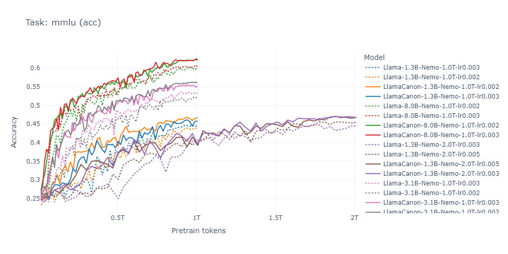

# Physics of Language Models: Part 4 Code Release
[](https://physics.allen-zhu.com/part-4-architecture-design/part-4-1)
[](https://ssrn.com/abstract=5240330)
[](https://github.com/facebookresearch/PhysicsLM4)
[](https://huggingface.co/facebook/PhysicsLM4.2__LlamaCanon-1B-Nemo-2T-lr0.005)

**Author**: Zeyuan Allen-Zhu  

Welcome to this code repository for the *Physics of Language Models* series. This repository provides all the resources required to reproduce results from the series' Part 4, as well as relevant contributions from Parts 1, 3.1, and 3.3. Below, we describe the key components of this release.

---

## 📑Repository Contents

### `synthetic-pretrain` (not yet released)
The synthetic pretraining playground, featuring datasets Depo, Brevo, Capo, Mano, and Lano from [*Physics of Language Models: Part 4.1, Architecture Design and the Magic of Canon Layers*](https://ssrn.com/abstract=5240330):

- **Lano dataset**: also covers [*Physics of Language Models: Part 1, Learning Hierarchical Language Structures*](https://ssrn.com/abstract=5250639).
- **Capo dataset**: also covers [*Physics of Language Models: Part 3.1, Knowledge Storage and Extraction*](https://ssrn.com/abstract=5250633) and [*Physics of Language Models: Part 3.3, Knowledge Capacity Scaling Laws*](https://ssrn.com/abstract=5250617).
- **Status**: TBD (I'm working days and nights on this... stay tuned)

### [`huggingface`](huggingface/)
Huggingface-style models that add Canon layer supports, as highlighted in [*Physics of Language Models: Part 4.1*](https://ssrn.com/abstract=5240330):

- **Current models**:
  - **LlamaCanon**: Includes Canon layers, QK-norm, and partial RoPE support.
- **Upcoming models**:
  - GLA, GDN, and Mamba2 models. (Not yet released...)

### [`lingua_modified`](lingua_modified/)
A modified version of [Meta’s Lingua codebase](https://github.com/facebookresearch/lingua) which is optimized for efficient pretraining. Key modifications include:

- Added support for Canon layers, QK-norm, z-loss, and partial RoPE for Transformer.
- Compatibility with the above Hugging Face `LlamaCanon` model (*bonus*: a `load_from_lingua_state` method for seamless loading of Lingua state_dicts).

### [`lingua_recipes`](lingua_recipes/)
Comprehensive training recipes (YAML files) for reproducing our 16 released model weights [on Hugging Face](https://huggingface.co/facebook/PhysicsLM4.2__LlamaCanon-8B-Nemo-1T-lr0.003).
<div style="
  display: inline-block;
  transform: scale(0.9);
  transform-origin: top left;
  width: fit-content;
  white-space: nowrap;
">
<a href="https://huggingface.co/facebook/PhysicsLM4.2__Llama-1B-Nemo-1T-lr0.002">
  
</a>
<a href="https://huggingface.co/facebook/PhysicsLM4.2__LlamaCanon-1B-Nemo-1T-lr0.002">
  
</a>
<a href="https://huggingface.co/facebook/PhysicsLM4.2__Llama-1B-Nemo-1T-lr0.003">
  
</a>
<a href="https://huggingface.co/facebook/PhysicsLM4.2__LlamaCanon-1B-Nemo-1T-lr0.003">
  
</a>
<br/>
<a href="https://huggingface.co/facebook/PhysicsLM4.2__Llama-1B-Nemo-2T-lr0.003">
  
</a>
<a href="https://huggingface.co/facebook/PhysicsLM4.2__LlamaCanon-1B-Nemo-2T-lr0.003">
  
</a>
<a href="https://huggingface.co/facebook/PhysicsLM4.2__Llama-1B-Nemo-2T-lr0.005">
  
</a>
<a href="https://huggingface.co/facebook/PhysicsLM4.2__LlamaCanon-1B-Nemo-2T-lr0.005">
  
</a>
<br/>
<a href="https://huggingface.co/facebook/PhysicsLM4.2__Llama-3B-Nemo-1T-lr0.002">
  
</a>
<a href="https://huggingface.co/facebook/PhysicsLM4.2__LlamaCanon-3B-Nemo-1T-lr0.002">
  
</a>
<a href="https://huggingface.co/facebook/PhysicsLM4.2__Llama-3B-Nemo-1T-lr0.003">
  
</a>
<a href="https://huggingface.co/facebook/PhysicsLM4.2__LlamaCanon-3B-Nemo-1T-lr0.003">
  
</a>
<br/>
<a href="https://huggingface.co/facebook/PhysicsLM4.2__Llama-8B-Nemo-1T-lr0.002">
  
</a>
<a href="https://huggingface.co/facebook/PhysicsLM4.2__LlamaCanon-8B-Nemo-1T-lr0.002">
  
</a>
<a href="https://huggingface.co/facebook/PhysicsLM4.2__Llama-8B-Nemo-1T-lr0.003">
  
</a>
<a href="https://huggingface.co/facebook/PhysicsLM4.2__LlamaCanon-8B-Nemo-1T-lr0.003">
  
</a>
</div>

### [`lingua_results`](lingua_results/)
Complete evaluation results for the 16 released models:

- Strong **controlled experiments** to highlight the benefits of Canon layers by comparing Llama vs. LlamaCanon in real-world pretraining settings.

- Includes **interactive training-time charts** for benchmarks like MMLU.
  <div align="center">
    
  </div>

- Benchmarks our models against other open-source models, demonstrating that we have conducted evaluations in a **realistic pretraining setup** rather than relying on artificial scenarios.
  <div align="center">
    
  </div>

These results from real-life pretraining will be officially published as part of *Physics of Language Models: Part 4.2*.

---

## 📖Citations

If you use this repository in your research, please cite the following:

```bibtex
@article{Allenzhu2025-canon,
  author = {{Allen-Zhu}, Zeyuan},
  title = {{Physics of Language Models: Part 4.1, Architecture Design and the Magic of Canon Layers}},
  year = {2025},
  month = {May},
  journal = {SSRN Electronic Journal},
  note = {\url{https://ssrn.com/abstract=5240330}}
}
```

Additional citations will be added in future updates to this repository.

---

## License

- Original contributions in this repository are all licensed under **Apache 2.0**.
- Modifications to the Lingua codebase adhere to its original **BSD-3-Clause** license (see `lingua_modified/README.md` for details).
