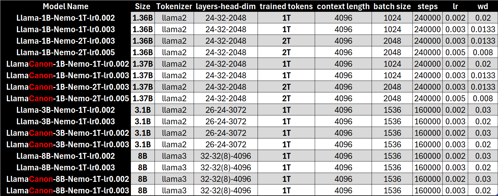

# Training Recipes for Llama and LlamaCanon

**Author**: Zeyuan Allen-Zhu  

---

This folder contains the complete training recipes (YAML files, suitable for Lingua codebase) for reproducing our 16 released model weights available [on Hugging Face](https://huggingface.co/facebook/PhysicsLM4.2__LlamaCanon-8B-Nemo-1T-lr0.003). The main model parameters are as follows:

<div align="center">

</div>

We additionally note the following:

* For 8B models, we have enabled **group-wise KV**, consistent with the [Llama-3.1-8B model](https://huggingface.co/meta-llama/Llama-3.1-8B/blob/main/config.json).
* For the 1B and 3B models, **QK-norm** and **z-loss** were enabled solely for demonstration purposes. They are **entirely unnecessary** for pretraining at scales ≤8B. For example, our 8B models were pretrained without QK-norm or z-loss, and the training remained highly stable (w/ and w/o Canon layers). In general, we found QK-norm and z-loss unhelpful for pretraining at scales ≤8B even when using bf16 precision.
* For the 1B and 3B models, we utilized the **Llama2 tokenizer** with a vocabulary size of 32,000. For the 8B models, we employed the **Llama3 tokenizer** with a vocabulary size of 128,256. Using the Llama3 tokenizer for smaller models would unnecessarily add 525M training parameters, which is not meaningful.  
* For the 8B models, we increased `rope_theta` to 100,000.  

We hope these released results inspire greater confidence among users of Canon layers. Canon layers are fully compatible with fine-grained transformer variants, including different tokenizers, group-wise KV, QK-norm, z-loss, and more. Our paper, [*Physics of Language Models: Part 4.1*](https://ssrn.com/abstract=5240330), explores this topic in depth. It specifically emphasizes how the integration of residual links in Canon layers, coupled with the default PyTorch initialization (rather than alternatives like `std=0.02`), ensures outstanding training stability. **To date, we have not encountered any scenario where Canon layers fail to deliver noticeable benefits.**

## 🔗Links (huggingface model weights)

<div style="
  display: inline-block;
  transform: scale(0.9);
  transform-origin: top left;
  width: fit-content;
  white-space: nowrap;
">
<a href="https://huggingface.co/facebook/PhysicsLM4.2__Llama-1B-Nemo-1T-lr0.002">
  
</a>
<a href="https://huggingface.co/facebook/PhysicsLM4.2__LlamaCanon-1B-Nemo-1T-lr0.002">
  
</a>
<a href="https://huggingface.co/facebook/PhysicsLM4.2__Llama-1B-Nemo-1T-lr0.003">
  
</a>
<a href="https://huggingface.co/facebook/PhysicsLM4.2__LlamaCanon-1B-Nemo-1T-lr0.003">
  
</a>
<br/>
<a href="https://huggingface.co/facebook/PhysicsLM4.2__Llama-1B-Nemo-2T-lr0.003">
  
</a>
<a href="https://huggingface.co/facebook/PhysicsLM4.2__LlamaCanon-1B-Nemo-2T-lr0.003">
  
</a>
<a href="https://huggingface.co/facebook/PhysicsLM4.2__Llama-1B-Nemo-2T-lr0.005">
  
</a>
<a href="https://huggingface.co/facebook/PhysicsLM4.2__LlamaCanon-1B-Nemo-2T-lr0.005">
  
</a>
<br/>
<a href="https://huggingface.co/facebook/PhysicsLM4.2__Llama-3B-Nemo-1T-lr0.002">
  
</a>
<a href="https://huggingface.co/facebook/PhysicsLM4.2__LlamaCanon-3B-Nemo-1T-lr0.002">
  
</a>
<a href="https://huggingface.co/facebook/PhysicsLM4.2__Llama-3B-Nemo-1T-lr0.003">
  
</a>
<a href="https://huggingface.co/facebook/PhysicsLM4.2__LlamaCanon-3B-Nemo-1T-lr0.003">
  
</a>
<br/>
<a href="https://huggingface.co/facebook/PhysicsLM4.2__Llama-8B-Nemo-1T-lr0.002">
  
</a>
<a href="https://huggingface.co/facebook/PhysicsLM4.2__LlamaCanon-8B-Nemo-1T-lr0.002">
  
</a>
<a href="https://huggingface.co/facebook/PhysicsLM4.2__Llama-8B-Nemo-1T-lr0.003">
  
</a>
<a href="https://huggingface.co/facebook/PhysicsLM4.2__LlamaCanon-8B-Nemo-1T-lr0.003">
  
</a>
</div>

## 📖Citation
Please cite the following if you use our models or findings in your research:
```bibtex
@article{Allenzhu2025-canon,
  author = {{Allen-Zhu}, Zeyuan},
  title = {{Physics of Language Models: Part 4.1, Architecture Design and the Magic of Canon Layers}},
  year = {2025},
  month = {May},
  journal = {SSRN Electronic Journal},
  note = {\url{https://ssrn.com/abstract=5240330}}
}
```