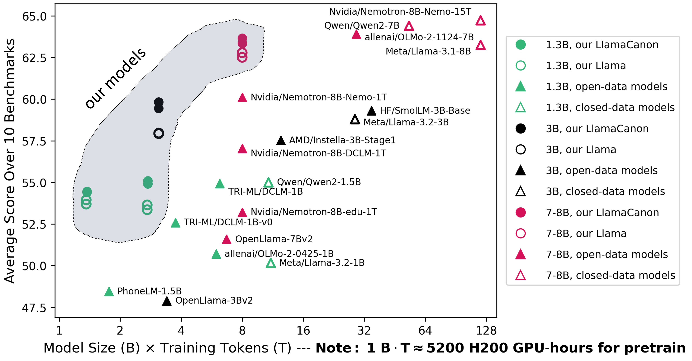
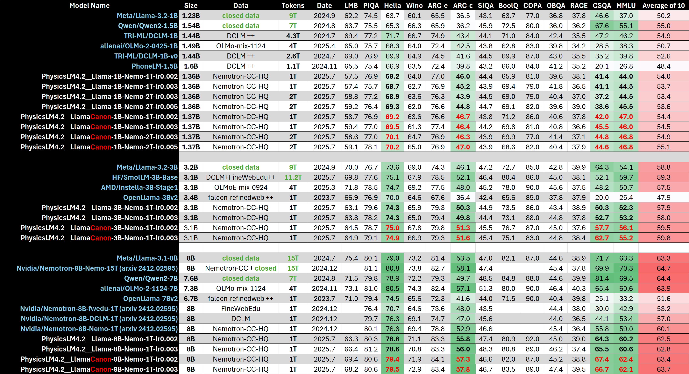

# Physics of Language Models: LlamaCanon Release

Our released paper, [*Physics of Language Models: Part 4.1, Architecture Design and the Magic of Canon Layers*](https://ssrn.com/abstract=5240330), demonstrates that the Canon layer is a powerful architecture add-on that improves language model performance on multiple fronts using a synthetic pretraining playground, perhaps for *every* possible architecture (original Transformer or linear models). 

In this release, we provide code and pre-trained models to showcase how these findings extend to real-world pretraining. Specifically, we compare the vanilla *Llama architecture* with our modified *LlamaCanon* variant, both pretrained under the same *controlled settings*.

<div align="center">

<em><b>Figure 1:</b> Quick illustration of performance vs. model size/training time.</em>
</div>

## Highlights of the Release

1. **Broad Model Availability**: We release 16 base models (1B, 3B, and 8B) pretrained on the open-sourced [Nemotron-CC](https://arxiv.org/pdf/2412.02595) dataset for 1T or 2T tokens.
2. **Controlled Experiment**: In each setting, we pretrain two versions of LlamaCanon (using two learning rates) and compare them against two corresponding versions of the original Llama pretrained with identical hyperparameters. This ensures a rigorous architectural comparison.
3. **Performance Gain**: LlamaCanon consistently surpasses Llama in all eight controlled comparisons, achieving, for instance, a 2% gain in the MMLU benchmark.
4. **Comparison to Open Models**: Our experiments are benchmarked against open-sourced models trained on similar datasets, ensuring that we study a *realistic pretraining setup* rather than an artificial scenario.

## Model Configurations

A detailed summary of the 16 models we release along with their parameters can be seen below. (Note, for LlamaCanon models, although pretrained with 4096 tokens, they can length generalize to about 50% more tokens, see [our paper](https://ssrn.com/abstract=5240330).)
<div align="center">

<br/>
<em><b>Figure 2:</b> Names and model parameters.</em>
</div>

(full configs see [lingua_recipes](../lingua_recipes).)

## Performance Metrics

The table below compares the performance of **LlamaCanon** against both vanilla Llama models and several open-sourced pretraining benchmarks. For all open-sourced models, we re-evaluated them using the [`lm-evaluation-harness`](https://github.com/EleutherAI/lm-evaluation-harness) toolkit under a consistent evaluation environment. As a result, the reported accuracies may differ slightly from those in their original papers. For **Nvidia's Nemotron-CC** pretrained models, which are not open-sourced, we directly report their [published accuracies](https://arxiv.org/abs/2412.02595).
<div align="center">
  
  <em><b>Figure 3:</b> Cross-benchmark performance comparison of the evaluated models.</em>
</div>


### Training Curves

To further showcase the advantage of Canon layers over the entirety of the pretraining process, we provide detailed training-time performance curves. Interactive versions and additional benchmark metrics are available in the [this HTML](training-curves-interactive.html) (you must download it first to play interactively) but below is a snapshot:
<div align="center">

<em><b>Figure 4:</b> MMLU accuracy vs. training tokens.</em>
</div>

> *Note 1*: Although both Figure 3 and 4 adopt [`lm-evaluation-harness`](https://github.com/EleutherAI/lm-evaluation-harness), in Figure 3 we adopt their original [`HFLM`](https://github.com/EleutherAI/lm-evaluation-harness/blob/main/lm_eval/models/huggingface.py) implementation together with a mixed-precision bf16 evaluation pipeline (code not provided here); while in Figure 4 we use the Lingua's integrated pure bf16 evaluation. Therefore, the accuracies may slightly differ.

> *Note 2*: The original Lingua codebase adds bos token during evaluation (which we have removed in [`lingua_modified`](../lingua_modified) to match [`HFLM`](https://github.com/EleutherAI/lm-evaluation-harness/blob/main/lm_eval/models/huggingface.py)), and adding bos may result in slightly different curves, see [MMLU accuracy with added bos token](curve-mmlu-bos.png).


### Link to Model Weights

See [Hugging Face](https://huggingface.co/facebook/PhysicsLM4.2__LlamaCanon-8B-Nemo-1T-lr0.003).

## Citation

Please cite the following if you use our models or findings in your research:
```bibtex
@article{Allenzhu2025-canon,
  author = {{Allen-Zhu}, Zeyuan},
  title = {{Physics of Language Models: Part 4.1, Architecture Design and the Magic of Canon Layers}},
  year = {2025},
  month = {May},
  journal = {SSRN Electronic Journal},
  note = {\url{https://ssrn.com/abstract=5240330}}
}
```

Note: A technical report for this model release will appear under *Physics of Language Models: Part 4.2*. Until then, please cite the above paper.
